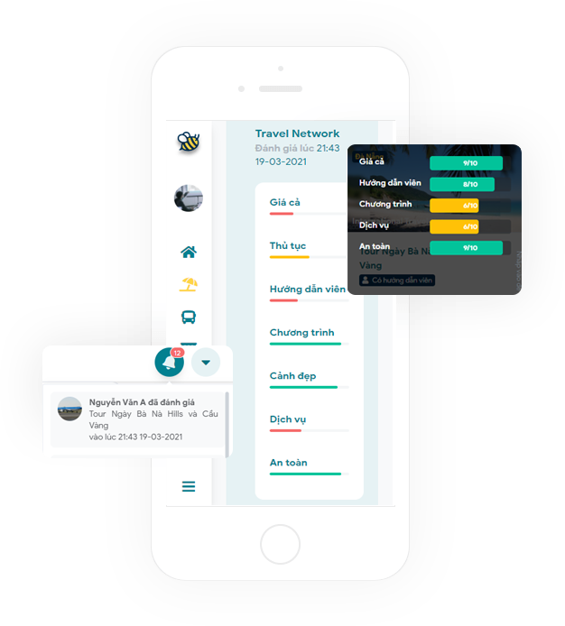
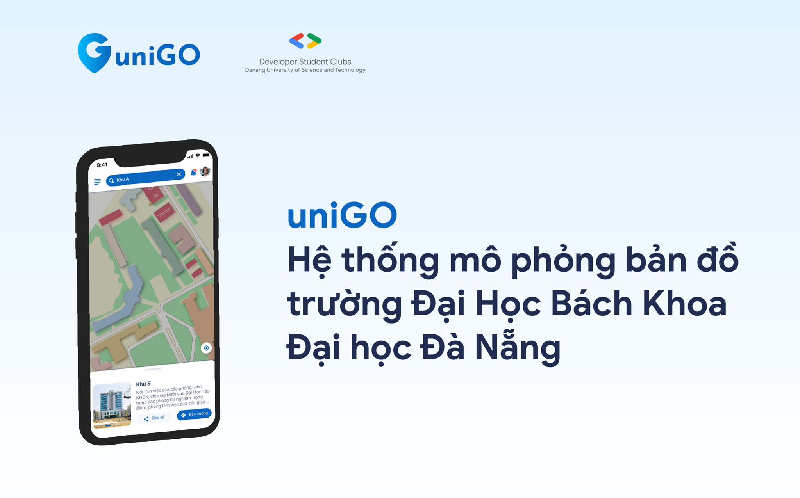

↖️ (Feeling lost? Use the GitHub TOC!)

# AWESOME GDSC VIETNAM

Looking for a maintainer: ongeditvideo@gmail.com

> I no longer in GDSC so kinda hard to update the newest stuff

## Project DSC in Vietnam

### ProVo

- About: ProVo is an ecosystem providing a IELTS Writing Support service and an mobile app with a collective database of Advanced Vocab and Synonyms.
- Website: <https://provo.dscdut.com/>
- Download app (Android): <https://play.google.com/store/apps/details?id=com.huy3999.provo>
- GDSC chapter: [Da Nang University of Technology](#da-nang-university-of-technology)

### beebee.travel

- About(vietnamese website): <https://beebee.travel/>
- Try app: <https://app.beebee.travel/>
- GDSC chapter: [Da Nang University of Technology](#da-nang-university-of-technology)

### uniGO

- About: Danang University of Technology virtual interactive map, Designed by Developer Student Clubs with basic algorithms and popular technology platforms, uniGO makes it easier for users to locate classrooms, buildings, functional departments… as well as to look up for detailed information on these locations.
- Website: <https://unigo.pro/>
- GDSC chapter: [Da Nang University of Technology](#da-nang-university-of-technology)

### Google GDSC Loading spinner

&emsp;

- About: A Loading spinner for the Google Developer student clubs.
- Source Code: <https://github.com/dscdut/loading.vndsc.com>
- GDSC chapter: [Da Nang University of Technology](#da-nang-university-of-technology)

### Smart Garden System API

- About: Provides some API for monitoring and controlling a garden model (small) using Arduino + Raspberry Pi
- Source code: https://github.com/DSC-HSU/SmartGarden#smart-garden-system-api
- GDSC chapter: [Hoa Sen University](#hoa-sen-university)

### URL shortener

- Website: https://url.dscdut.com/
- GDSC chapter: [Da Nang University of Technology](#da-nang-university-of-technology)
- Source code: https://github.com/dscdut/url.dscdut.com

### Bookban

- About(vietnamese): https://www.facebook.com/dsc.fptudn/posts/181046613666917
- GDSC chapter: [FPT University Danang](#FPT-University-Danang)

### "Contact me"- Ứng dụng giải quyết việc làm “ONLINE”

- About(vietnamese): https://www.facebook.com/dsc.fptudn/posts/180360403735538
- GDSC chapter: [FPT University Danang](#FPT-University-Danang)

### REBO (Nền tảng thiết kế bài giảng trực tuyến lý tưởng dành cho giáo viên và học sinh)

- About(vietnamese): https://www.facebook.com/dsc.fptudn/posts/179671193804459
- GDSC chapter: [FPT University Danang](#FPT-University-Danang)

### The Shareapy mobile app

- About: Vo Ngoc Khanh Linh, Tran Lam Bao Khang, Nguyen Dang Huy, and Nguyen Thanh Nhan built Shareapy: a digitized support group app created with Android that helps bring people together who share similar problems regardless of their age, gender, religion, financial status, etc. After conducting an extremely rigorous user testing phase, this team had the chance to see all that TensorFlow and Firebase could do.
- Video: https://www.youtube.com/watch?v=63RTBxRyFX8&t=3557s
- GDSC chapter: [Ho Chi Minh City University of Technology](#ho-chi-minh-city-university-of-technology)

## Resource for GDSC

- DSC docs:
  - https://developers.google.com/community/dsc/leads
  - https://msaaddev.github.io/DSC-docs-live/
- Design:
  - DSC STU brand resources: https://www.figma.com/file/DV5P2siVlzER4ziHju2qNg/Brand-resources-Google-DSC-STU
- Free resources for GDSC Leads: https://docs.google.com/document/d/1D4tJDb-kWRqPMreBfgbMkUc9eHwM4bFeocFvWs8rJf8/
- Virtual DevSpace - Organizer Guide: https://goo.gle/virtual-devspace
- Open-source illustration: https://2.flexiple.com/scale/all-illustrations
- GitHub student pack: https://education.github.com/pack
- Awesome list: https://github.com/topics/awesome-list

## Posts from the GDSC chapter in Vietnam

- Bộ mấy làm việc của nhà DSC-DUT: https://www.facebook.com/dscdut/posts/551884899550271
- 4 lầm tưởng tai hại khiến bạn bỏ lỡ cơ hội trở thành thành viên của [DSC-DUT](#da-nang-university-of-technology)!: https://www.facebook.com/dscdut/posts/493292708742824
- FIELD TRIP - LÍ DO TO BỰ BẠN NÊN THAM GIA DSC-DUT: https://www.facebook.com/dscdut/posts/492592898812805
- LỢI ÍCH TUYỆT VỜI KHI THAM GIA DSC-DUT, BẠN ĐÃ BIẾT HAY CHƯA?: https://www.facebook.com/dscdut/posts/492103838861711
- 3 ĐIỀU CẤM KỴ CHO GIAO THỪA, MỒNG MỘT TẾT CỦA DÂN IT DSC\_-DUT: https://www.facebook.com/dscdut/posts/477732203632208
- DSC-DTU: https://www.facebook.com/dscdut/posts/413517370053692
- DSC-DTU: https://www.facebook.com/dscdut/posts/374882233917206
- Có những thứ giá trị nhưng không hề lấp lánh DSC-DTU: https://www.facebook.com/dscdut/posts/295722405166523
- "Người ta hỏi em về chất gây nghiện em kể họ nghe về DSC-DUT": https://www.facebook.com/dscdut/posts/290200789052018
- "Sau cơn mưa trời lại sáng DSC-DTU xứng đáng thì mình yêu": https://www.facebook.com/dscdut/posts/288023562603074
- "Cuộc đời mình vốn là 1 đường thẳng, vì DSC-DTU mà rẽ ngang": https://www.facebook.com/dscdut/posts/282475416491222
- "Nam quốc sơn hà nam đế cư vào DSC-DTU vui thế ư? Thanh xuân mấy lần như thế nhỉ Vào đây mình cùng cười hihi": https://www.facebook.com/dscdut/posts/279503123455118
- "8 điều mà bạn có thể làm ở nhà trong mùa dịch": https://www.youtube.com/watch?v=OhyuyCK2c-Y
- DSC-DUT Shooting Profile | Media shooting ft. BM, Marketing and Technical team: https://www.youtube.com/watch?v=hBiVzwGNh1c
- Khi tech leader nhà dsc sắp thi trắc nghiệm đường lối cách mạng DSC-DuyTan: https://www.facebook.com/dsc.duytan/posts/431655504841866
- Làm sao để thoát khỏi Ế "bền vững": https://www.facebook.com/dsc.duytan/posts/246685043338914
- [Smart Garden System API](#Smart-Garden-System-API): https://www.youtube.com/watch?v=eQglBfZroog
- 🟩 THE ENTHUSIASTIC GREEN OF EVENT OPERATION 🟩: https://www.facebook.com/dsc.hcmut/posts/372328027515386
- 🟨 THE DELICATE YELLOW OF MARKETING 🟨: https://www.facebook.com/dsc.hcmut/posts/372327650848757
- 🟥 THE FIREY RED OF INNOVATION 🟥: https://www.facebook.com/dsc.hcmut/posts/371493917598797
- 🟦 THE WISE BLUE OF DEVELOPMENT 🟦: https://www.facebook.com/dsc.hcmut/posts/371487384266117
- 🌟MEET THE LEAD: NGUYEN THANH NHAN🌟: https://www.facebook.com/dsc.hcmut/posts/369917667756422

## GDSC Chapter in Vietnam

### Da Nang University of Technology

- Community: https://dsc.community.dev/da-nang-university-of-technology/
- Website: https://google.dscdut.com/
- GitHub: https://github.com/dscdut
- Facebook: https://www.facebook.com/dscdut
- YouTube: https://www.youtube.com/channel/UCh5G4Fgl_WcOBB2LF73x3Ww/featured
- Linkedin: https://www.linkedin.com/company/dscdut/
- Instagram: https://www.instagram.com/dsc_dut/

### Duy Tan University

- Community: https://dsc.community.dev/duy-tan-university/
- Website: https://dtudsc.web.app/
- Facebook: https://www.facebook.com/gdsc.duytan/
- Facebook Group: https://www.facebook.com/groups/461865691319528
- Instagram: https://www.instagram.com/dsc.dtu/

### Hoa Sen University

- Community: https://dsc.community.dev/hoa-sen-university/
- Facebook: https://www.facebook.com/gdsc.hsu/
- YouTube: https://www.youtube.com/channel/UCcbTBRzIfnE-EhixqOWJCtg
- GitHub: https://github.com/DSC-HSU

### Saigon University

- Community: https://gdsc.community.dev/sai-gon-university-sgu/
- Facebook: https://www.facebook.com/sgudsc/

### FPT University Danang

- Community: https://dsc.community.dev/fpt-university-danang/
- Facebook: https://www.facebook.com/dsc.fptudn
- Linkedin: https://www.linkedin.com/company/dscfptudn/

### FPT University HCMC

- Community: https://dsc.community.dev/fpt-university-hcmc/
- Facebook: https://www.facebook.com/dsc.fptu.hcmc
- GitHub: https://github.com/DSC-FPTU-HCMC

### Ton Duc Thang University

- Community: https://dsc.community.dev/ton-duc-thang-university/
- Facebook: https://www.facebook.com/dsc.tdtu
- GitHub: https://github.com/DSC-Ton-Duc-Thang-University

### University of Information Technology VNU-HCM

- Community: https://dsc.community.dev/university-of-information-technology-vnu-hcm/
- Facebook: https://www.facebook.com/dsc.uit/

### VNU HCM (University of Technology)

- Community: https://dsc.community.dev/vnu-hcm-university-of-technology/
- Facebook: https://www.facebook.com/dsc.hcmut
- GitHub: https://github.com/dsc-hcmut

### Vietnam National University

- Community: https://dsc.community.dev/vietnam-national-university/
- Facebook: https://www.facebook.com/dscvnu/

### University of Greenwich Vietnam

- Community: https://dsc.community.dev/university-of-greenwich-vietnam/
- Facebook: https://www.facebook.com/dsc.uog/

### Hanoi University of Science & Technology (HUST)

- Community: https://dsc.community.dev/hanoi-university-of-science-technology-hust/
- Facebook: https://www.facebook.com/dsc.hust.2020/
- Phone: +84 83 837 5899
- Website: http://www.dsc-hust.club/
- Email: dsc.hust.2020@gmail.com

### VNU HCM (University of Science (Thu Duc))

- Community: https://dsc.community.dev/vnu-hcm-university-of-science-thu-duc/
- Facebook: https://www.facebook.com/dsc.hcmus

### VNU HCM (University of Science (Nguyen Van Cu))

- Community: https://dsc.community.dev/vnu-hcm-university-of-science-nguyen-van-cu/
- Facebook: https://www.facebook.com/dsc.hcmus

### VNU HCM (International University)

- Facebook: https://www.facebook.com/dsc.hcmiu

### VNUK Institute for Research and Executive Education, the University of Danang

- Facebook: https://www.facebook.com/dscvnuk/

### VNU HCM (University of Industry)

- Community: https://dsc.community.dev/vnu-hcm-university-of-industry/

### University of Greenwich Vietnam Hanoi

- Community: https://dsc.community.dev/university-of-greenwich-vietnam-hanoi/

### Posts and Telecommunications Institute of Technology

- Community: https://dsc.community.dev/posts-and-telecommunications-institute-of-technology/

### Ho Chi Minh City University of Technology

- Community: https://dsc.community.dev/ho-chi-minh-city-university-of-technology/

### Eastern International University

- Community: https://dsc.community.dev/eastern-international-university/

### Foreign Trade University

- Facebook: https://www.facebook.com/dsc.ftu2/

### HCMC University of Technology and Education

- Facebook: https://www.facebook.com/gdsc.hcmute
- GitHub: https://github.com/DSC-HCMUTE
- Email: dsc.hcmute@gmail.com

### Hanoi University

- Facebook: https://www.facebook.com/hanugdsc
- Email: hanugdsc@gmail.com

### Hanoi University of Mining and Geology

- Facebook: https://www.facebook.com/gdsc.humg
- Email: dsc.humg@gmail.com

### Industrial University of Ho Chi Minh City

- Facebook: https://www.facebook.com/iuh.gdsc
- Email: team@iuhgdsc.com
- Twitter: https://twitter.com/iuhgdsc
- GitHub: https://github.com/iuhgdsc
- Instagram: https://www.instagram.com/iuh.gdsc/
- Youtube: https://www.youtube.com/channel/UCeDvhkh14Y1QtNRfo5nhRbg
- Community: https://iuhgdsc.page.link/community

### Vietnam Academy of Cryptography Techniques

- Facebook: https://www.facebook.com/dsc.kma
- Email: dsckma@gmail.com

### University of Greenwich Vietnam (Can Tho)

- Facebook: https://www.facebook.com/profile.php?id=100070791010056

### University of Economics and Law

- Facebook: https://www.facebook.com/gdsc.uel
- Email: gdsc.uel@gmail.com
